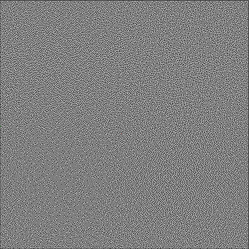
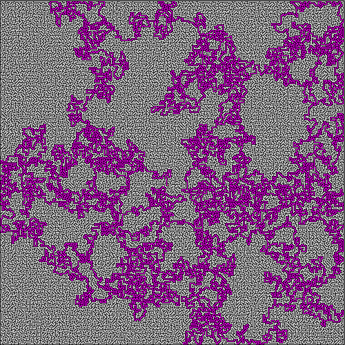

# MazeGenerator
Generates a maze and saves it as a .bmp image

To build install CMake, make and a c++ compiler
and follow these commands 

- mkdir build
- cd build
- cmake ..
- make
- ./demo

after this you will find the generated images in the build directory.
